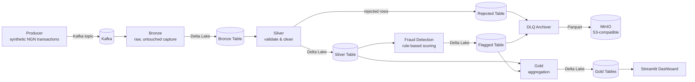

Ledger-grade transaction pipeline
A real-time bank transaction pipeline, built from scratch: Kafka ingestion, a Bronze, Silver, and Gold setup on Delta Lake, rule-based fraud detection, an S3-compatible dead-letter queue, and a live dashboard to watch it all happen. Runs entirely on Docker, no cloud account needed.
I built this to get hands-on with real data engineering patterns, using simulated Nigerian bank transactions (NGN) end to end.
Architecture

Flow: Producer → Kafka → Bronze → Silver → Fraud Detection → (DLQ archive + Gold aggregation) → Dashboard
Every stage runs as its own continuous, long-lived process in its own Docker container — nothing is a one-off batch script. Each stage uses crash-safe, identity-based progress tracking (not row position), so a crash can cause at most a few duplicate reprocessed rows, never silent data loss.
Stack
Ingestion: Apache Kafka (KRaft mode, no Zookeeper), `confluent-kafka` Python client
Storage format: Delta Lake via the `deltalake` Python library (no Spark/JVM — direct Rust bindings)
Object storage: MinIO (S3-compatible)
Fraud logic: rule-based scoring (velocity, amount anomaly, new high-value counterparty)
Dashboard: Streamlit, auto-refreshing via `st.fragment(run_every=...)`
Orchestration: Docker Compose, 8 services
Pipeline stages
Stage	What it does
Producer	Generates synthetic deposits/withdrawals/transfers across 300 NGN accounts with persisted, realistic balances. Periodically injects burst-mode fraud patterns and deliberately malformed messages, tagged with ground-truth metadata for later validation.
Bronze	Kafka consumer. Writes every message to Delta Lake exactly as received — including malformed ones — with an explicit fixed schema. Never validates or drops data.
Silver	Reads Bronze, validates structural correctness (not business outcome — a failed-insufficient-funds withdrawal is valid data). Splits into clean (Silver) and broken (Rejected) tables.
Fraud Detection	Reads Silver, scores each transaction against 3 rules using persisted per-account behavioral history (rolling velocity window, running amount average, known-counterparty set). Flags suspicious transactions with explainable reasons.
DLQ Archiver	Archives Flagged and Rejected records to MinIO as partitioned Parquet files (`source/date=YYYY-MM-DD/`).
Gold	Recomputes 4 business-ready aggregate tables every cycle: daily volume, account balances, daily fraud rate, top accounts by activity.
Dashboard	Streamlit app, 3 tabs (Overview, Accounts, Fraud Monitoring), reading live from Gold.
Running it
Requires Docker Desktop.
```bash
cd docker
docker compose up -d --build
```
This builds and starts all 8 services. First build takes a few minutes (Kafka and dependency images aren't tiny). Open the dashboard at `http://localhost:8501` and the MinIO console at `http://localhost:9001` (default credentials in `docker-compose.yml` — hardcoded intentionally, since this is a local-only dev setup with no external network exposure).
What this demonstrates
Kafka producer/consumer patterns with manual offset commits for crash safety
Medallion architecture (Bronze/Silver/Gold) on a real lakehouse table format
Data quality gating with explainable rejection reasons
Rule-based fraud detection validated against self-planted ground-truth fraud patterns
S3-compatible object storage for dead-letter archival
A continuously running, multi-service system — not a notebook or one-shot script
Things that went wrong, and what they taught me
A project like this is mostly a series of bugs, not a clean build — these were the real ones, not hypothetical "lessons learned" filler:
A Delta table's row order isn't guaranteed to match write order. Silver originally tracked progress by row count ("I've processed the first N rows"). This silently broke — a deliberately malformed test message sat unprocessed for thousands of cycles before I caught it, because `to_pyarrow_table()` returned a later-written batch before an earlier one. Fixed by tracking progress by `(partition, offset)` identity instead of position — the same lesson Kafka's own offset model teaches, just relearned the hard way at the Delta layer.
PyArrow infers column types from batch contents. A Bronze batch where every row happened to have `None` in the same field made PyArrow unable to infer that column's type, crashing the write with `Invalid data type for Delta Lake: Null`. Fixed by defining an explicit fixed schema up front instead of letting it be inferred per-batch.
A fraud rule that "worked" wasn't actually meaningful. An early version of the new-counterparty fraud rule flagged 14% of all transactions — because the producer picks transfer recipients randomly, so most transfers are naturally to a first-time counterparty. The rule wasn't wrong, the test data didn't model real customer behavior (recurring relationships). Fixed by requiring a new counterparty AND an anomalous amount together, which better reflects what's actually suspicious — and dropped the false-positive rate to ~2%.
A "from-scratch" aggregation can be the wrong instinct. Gold initially tried to reconstruct account balances purely from transaction history, starting every account at zero. This produced impossible negative balances, because each account's real starting balance was never recorded as an event anywhere in the pipeline — it only ever existed in the producer's in-memory state. The fix was realizing the producer's live balance was already the enforced source of truth, and Gold re-deriving it independently was solving an already-solved problem, badly.
Every number got cross-checked against an independently computed version before being trusted — daily volume against raw Silver row counts, fraud rate against the Flagged table's actual size, account balances against zero-negative-balance and total-account-count sanity checks. Two of these checks initially "failed" by a small margin and turned out to be timing artifacts (the pipeline never stops, so two queries run seconds apart will legitimately disagree) rather than bugs — which was its own lesson in not jumping to conclusions from a mismatch alone.
Project structure
```
ledger_pipeline/
├── docker/      docker-compose.yml — orchestrates all 8 services
├── producer/    synthetic transaction generator
├── bronze/      raw Kafka → Delta Lake capture
├── silver/      validation, clean/rejected split
├── fraud/       rule-based fraud scoring
├── dlq/         MinIO archival
├── gold/        business aggregate tables
└── dashboard/   Streamlit monitoring UI
```
